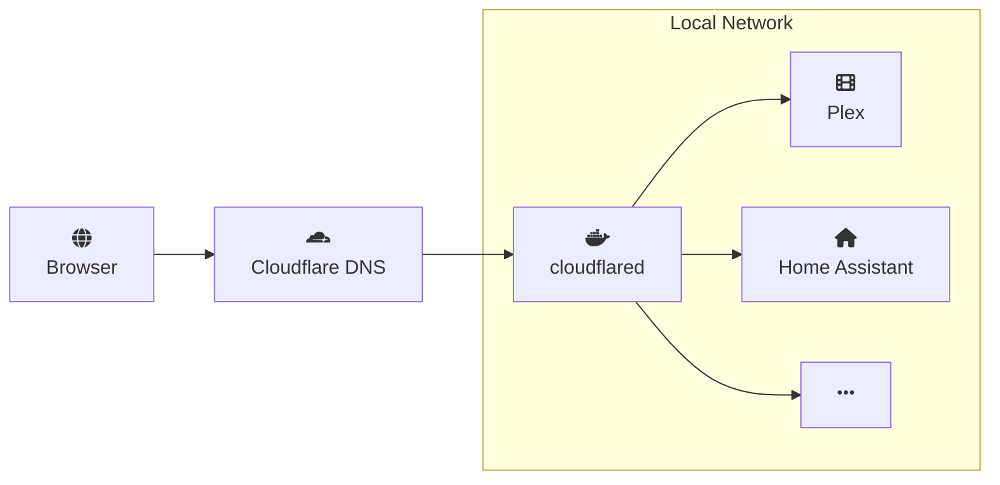

A homelab is the most practical way to learn infrastructure, services, and automation without relying on expensive data centers.

In this post I explain how an **old laptop** can be a great base for a home lab, how **Linux** and **Docker** help keep things organized, the role of a **reverse proxy**, and how to use a **custom domain + Cloudflare** to securely access your services from anywhere.

## What is a homelab?

A homelab is a test and learning environment set up at home, usually on owned hardware, to run network services, servers, and automation.

It's not a data center — it's a personal infrastructure where you can experiment with Linux, containers, proxies, domains, and integrations without depending on external providers.

## Why use an old laptop?

The biggest value of a homelab isn't raw power, it's the opportunity to learn.

- an old laptop already has CPU, memory, disk and power supply
- you can experiment without spending money
- it's easy to move and connect to different networks
- power consumption is often lower than a desktop
- the battery can act as a small UPS for short outages

With reused hardware, the best practice is to treat the environment as experimental. Don't run critical services — use it to learn and automate.

## Linux + Docker: the right duo to start

For a lightweight and predictable homelab, I recommend installing a stable Linux distribution and running services in containers.

### Why Linux?
- excellent support for networking, firewalls and disks
- native support for `docker`, `nginx`, `systemd` and networking services
- minimal graphical overhead leaving more resources for services
- active community and abundant documentation

### What is Docker?
Docker is a platform that packages applications and their dependencies into lightweight containers — think VMs but much smaller and faster. Each container only includes what the service needs to run, avoiding conflicts and keeping the host system clean.

### Why Docker?
- isolates each application in its own environment
- enables safer upgrades and rollbacks
- makes it easy to recreate and migrate the lab
- avoids installing dependencies directly on the host

`docker-compose` is a tool to define multiple containers in a single configuration file. Instead of starting each service manually, you describe images, volumes, ports and networks in one place and bring everything up with a single command like `docker compose up -d`.

Example `docker-compose.yml`:

```yaml
services:
  plex:
    image: linuxserver/plex
    volumes:
      - ./plex/config:/config
      - ./plex/media:/data
    ports:
      - '32400:32400'
    restart: unless-stopped

  homeassistant:
    image: ghcr.io/home-assistant/home-assistant:stable
    volumes:
      - ./homeassistant/config:/config
    network_mode: host
    restart: unless-stopped
```

This setup makes the homelab easier to manage and portable.

## How to access your homelab services

Most services you run in a homelab are web applications with a browser interface.

Initially you usually access each service directly via the laptop's IP and the container port. For example:

- `http://192.168.0.50:32400` for Plex
- `http://192.168.0.50:8123` for Home Assistant
- `http://192.168.0.50:8080` for qBittorrent

To prevent the IP from changing, configure your router to reserve a static IP for the homelab or use a DHCP reservation.

When you want to access your homelab from the internet, that's where a reverse proxy comes in. It allows friendly URLs like `plex.yourdomain.com` and routes requests to the correct internal service without exposing different ports.

## Reverse proxy explained

A reverse proxy is the entry point for your homelab. It receives external requests and forwards them to the appropriate service.

Common benefits:

- use a single public port (80/443)
- centralized TLS certificates
- protect internal services that don't need direct exposure
- route by hostname or path
- add caching and security rules when needed

Popular tools:

- **Nginx**: flexible and lightweight
- **Caddy**: automatic TLS and simple configuration
- **Traefik**: great for container-heavy environments
- **cloudflared**: useful when you prefer not to open router ports

## Custom domain + Cloudflare Tunnel

Using your own domain makes the homelab feel more professional and easier to remember.

Steps:

1. register a domain
2. point DNS to Cloudflare
3. create `CNAME` or `A` records for subdomains
4. configure a Cloudflare Tunnel (`cloudflared`)

`cloudflared` is a great option if your network lacks a public IP or you don't want to open router ports. Running `cloudflared` as a Docker container alongside your other services is convenient in homelab setups.

With the tunnel, the flow looks like this:



Benefits:

- secure HTTPS connections
- hide your real IP
- less need to change router rules

Quick example:

```bash
# login to Cloudflare (done once on host)
cloudflared login

# create tunnel
cloudflared tunnel create my-homelab

# route DNS
cloudflared tunnel route dns my-homelab homelab.yourdomain.com
```

Docker Compose example for `cloudflared`:

```yaml
services:
  cloudflared:
    image: cloudflare/cloudflared:latest
    container_name: cloudflared
    restart: unless-stopped
    network_mode: bridge
    volumes:
      - ./cloudflared:/etc/cloudflared
    command: tunnel run my-homelab
```

`cloudflared.yml` example:

```yaml
tunnel: <TUNNEL_ID>
credentials-file: /home/user/.cloudflared/<TUNNEL_ID>.json

ingress:
  - hostname: plex.yourdomain.com
    service: http://localhost:32400

  - hostname: home.yourdomain.com
    service: http://localhost:8123

  - hostname: qbittorrent.yourdomain.com
    service: http://localhost:8080

  - service: http_status:404
```

## Apps worth running in a homelab

- [Plex](https://www.plex.tv/) or [Jellyfin](https://jellyfin.org/): local media and remote access for videos and music
- [Home Assistant](https://www.home-assistant.io/): home automation and device integration
- [qBittorrent](https://www.qbittorrent.org/): managed downloads in an isolated container
- [Portainer](https://www.portainer.io/): GUI to view and manage Docker containers
- [Vaultwarden](https://github.com/dani-garcia/vaultwarden): lightweight self-hosted password manager
- [Uptime Kuma](https://github.com/louislam/uptime-kuma): simple service monitoring
- [Nextcloud](https://nextcloud.com/): personal cloud for files and notes

## Best practices for a healthy homelab

- keep backups of important data
- update containers regularly
- monitor the laptop's temperature and power usage
- use external volumes or SSDs when possible
- avoid mixing production services with risky experiments

---

## Conclusion

The goal of a homelab isn't perfection but a playground to learn without fear.

An old laptop is a great starting point: it lets you experiment with Linux, Docker, reverse proxies and custom domains at almost no cost.

Playing with a homelab is a way to turn curiosity into real infrastructure — and to repurpose forgotten hardware into something useful and fun.
