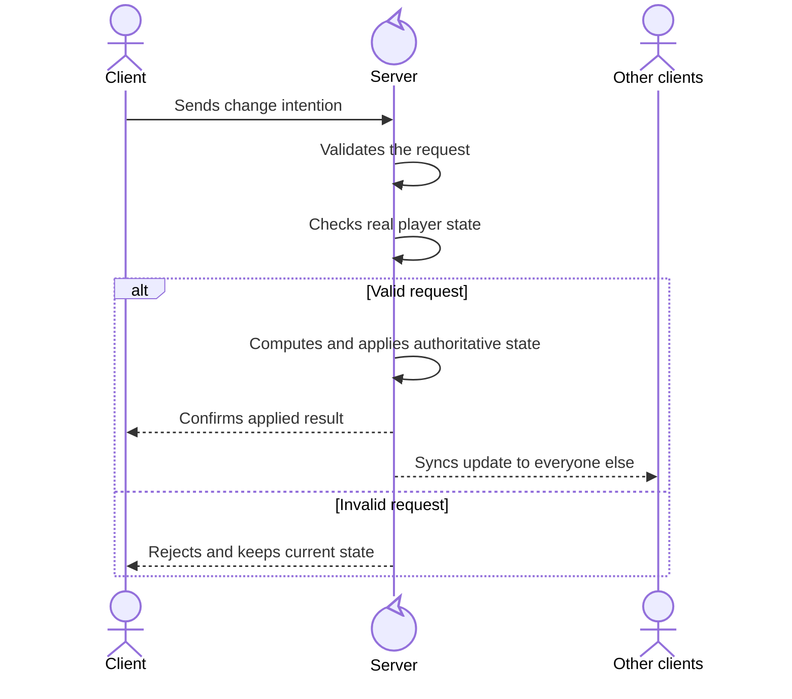

## The starting point

When I started the Naninhas mod, everything felt solid in *singleplayer*. The main *loop* worked, *buffs* were being applied, events fired correctly and the experience was smooth. The problem showed up when that same logic went into *multiplayer*: suddenly, something that worked perfectly simply did nothing.

That's when it clicked: "Oh right, *Multiplayer* games need to work for every *player*."


It became clear I needed to rethink how the *Naninhas* mod worked and adapt it for *Multiplayer*. After all, the whole reason I built the *mod* was to play with my friends on our **Zomboid** server.

## The turning point: server as authority

In **Naninhas**, applying *traits* and XP bonuses needs to be **authoritative** on the server. The client detects *attachment* changes and publishes the desired state, but the server is always the one making the final decision.

To make it concrete, here is the flow in plain language:

The final *mod* flow looks like this:
1. the **Client** sends the desired set of *plushies*
2. the **Server** validates the *payload* and confirms what is actually attached to the inventory
3. the **Server** reconciles effects
4. the **Server** replies with the applied set.



In short: the client asks, but the server always decides and applies.

## The network contract that made a difference

In the *multiplayer* plan, two choices were fundamental: using *schemaVersion* in the protocol and a monotonic *revision* per client. It sounds like a detail, but it is not. In a real game environment, delayed messages arrive, out-of-order messages arrive, reconnections happen. Without versioning and revision control, the server can mistakenly apply old state.


The validations that helped the most were few and clear:

- reject incompatible *schemaVersion*;
- reject outdated *revision*;
- reject unknown *plushie*;
- confirm *server-side* that the item is actually attached.

With that, the system became much more resilient against invalid *payloads* and session inconsistency.

### Real example: client publishing desired state

Now let's bring this to code. This is the heart of the client side: when it detects a change in attached items, it increments the *revision* and sends the desired state to the server.

```typescript
private send(names: Set<string>): void {
  // Increments the revision on every send; this lets the server
  // detect and discard old or out-of-order messages.
  this.revision++;
  // Stores a local snapshot of the last sent set.
  // This way the client knows if something changed on the next tick and avoids resending needlessly.
  this.lastKnownNames = new Set(names);

  const payload: SyncDesiredPlushiesPayload = {
    schemaVersion: PROTOCOL_SCHEMA_VERSION,
    revision: this.revision,
    desiredNames: [...names]
  };

  sendClientCommand(
    this.playerApi.player,
    NETWORK_MODULE,
    NetworkCommands.SyncDesiredPlushies,
    payload
  );
}
```

Notice that the client does not apply *traits* or XP bonuses on its own in this flow. It only publishes intention.

### Real example: server validating and rejecting stale state

On the server side, the main defense is blocking out-of-order messages to avoid overwriting new state with old state.

```ts
if (payload.revision <= protocol.lastClientRevision) {
  // A revision smaller than or equal to the last accepted one
  // means the message is delayed and should be ignored.
  this.sendRejectReply(player, payload);
  return;
}
```

This small block was one of the biggest contributors to reducing reconnection and latency bugs.

In practice, this kind of simple validation prevents a large portion of "ghost" sync bugs.

## Full *reconcile* instead of incremental patching

Another important learning was adopting a full *recompute* of the authoritative *snapshot*. Instead of trying to patch state piece by piece and risking duplicate *stacking*, the server rebuilds the target state from the current active set, removes what became obsolete, and only then reapplies what should remain.

If that sounds confusing, here is the plain version: instead of "patching" what changed, the server looks at the current state and recalculates everything from scratch — like taking a fresh photo of the situation at that moment. This avoids carrying over old errors, avoids duplicate bonuses, and makes the final result more predictable.

In simple terms: less incremental patching, more consistent final state.


In practice, this approach was easier to test, safer for *overlap* cases between *plushies*, and better for idempotency. Repeating the same *sync* should never stack effects, and with *reconcile* by *snapshot* that became much more predictable.

### Real example: pure and predictable *reconcile*

To make it visual, this snippet shows the part of the *reconciler* that computes the difference between what is active and what should be active.

```typescript
const currentAddedTraits = new Set(currentState.addedTraits);
const desiredAddedTraits = new Set<string>();

// Diff between current state and desired state.
const traitsToAdd = [...desiredAddedTraits].filter(t => !currentAddedTraits.has(t));
const traitsToRemove = [...currentAddedTraits].filter(t => !desiredAddedTraits.has(t));

return {
  traitsToAdd,
  traitsToRemove,
  traitsToSuppress,
  traitsToRestore,
  xpBoostDeltas,
  newState
};
```

This format makes tests more direct: given state A and desired state B, you validate whether the returned plan is exactly what is expected.

It also improves maintainability: when something breaks, it is easier to pinpoint whether the problem is in the input, the calculation, or the application.


## Events, *timing* is hard to get right

Even with the right architecture, *timing* remains a critical part of the experience. The mod's update events — `NaninhasEquipped`, `NaninhasUnequipped` and `NaninhasUpdate` — can fire at moments when the client has not yet received the final state.


To keep this concrete, here are three real adjustments made in the code.

### Real example: fixed order in the client cycle

In the update cycle, the mod first updates local observers and only then publishes the desired state to the server.

```typescript
// 1) Update local events (UI/hooks)
this.subject.update();

// 2) Publish desired state for authoritative sync
this.syncPublisher.tick();
```

This order avoids mixing responsibilities in the same step: the client handles local events and the server handles final state.

### Real example: events on the client, effects on the server

Another adjustment was keeping client events as signals only, without applying *traits* or XP locally.

```typescript
public subscribe() {
  triggerEvent(EventsEnum.Equipped, {
    name: this.name,
    ...this.data
  } as EventData);
}
```

Notice there is only `triggerEvent` here. The authoritative application of *traits* and bonuses happens on the server, inside the *reconcile* flow.

### Real example: treating reconnection as a special case

One *timing* case that caused real trouble was reconnection. When a client reconnects, `PlushieSyncPublisher` is recreated from scratch and *revision* resets to 1. Without explicit handling, the server would reject that first post-reconnect message by treating it as an old *revision*.

```typescript
// Reconnection recreates the publisher and resets revision to 1.
// Accepting this reset prevents the server from permanently rejecting
// the first message after any reconnect.
if (payload.revision === 1 && protocol.lastClientRevision > 0) {
  protocol.lastClientRevision = 0;
}
```

This detail is small in the code but solves a real problem: without it, any reconnection would result in state that never gets synchronized until the server is restarted.

With these three points together — fixed cycle order, separated event/effect responsibility, and reconnection handling — *timing* stopped being an unpredictable problem and became something handled explicitly.

## Unifying *Singleplayer* and *Multiplayer*

To avoid duplicated work, the natural next step was to unify the *Singleplayer* and *Multiplayer* logic into a single authoritative path — taking advantage of a **Zomboid** characteristic: *Singleplayer* is also, technically, a server. The same code applies with no duplication between game modes.

This was the natural next step to reduce complexity without losing reliability.

---

## Conclusion

Adding *multiplayer* to Naninhas was not just "adapting to networking". It meant transforming the entire *mod* into a distributed system with an explicit contract, defensive validation, and deterministic reconciliation.


---

## See it on GitHub
Here is the [pull request link](https://github.com/Dihgg/naninhas/pull/30) for the **Naninhas** *Multiplayer* support update. Take a look.
