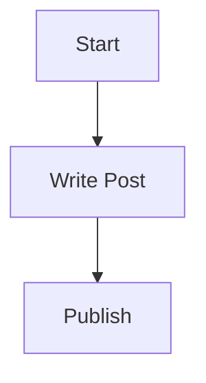
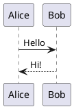

This is something to test

```typescript
const x = 10;
const foo = (a: number, b: number) => a + b;
```

test diagram 1:

```mermaid
graph TD
  A[Start] --> B[Write Post]
  B --> C[Publish]
```
test diagram 2:


```plantuml
@startuml
Alice -> Bob: Hello
Bob --> Alice: Hi!
@enduml
```