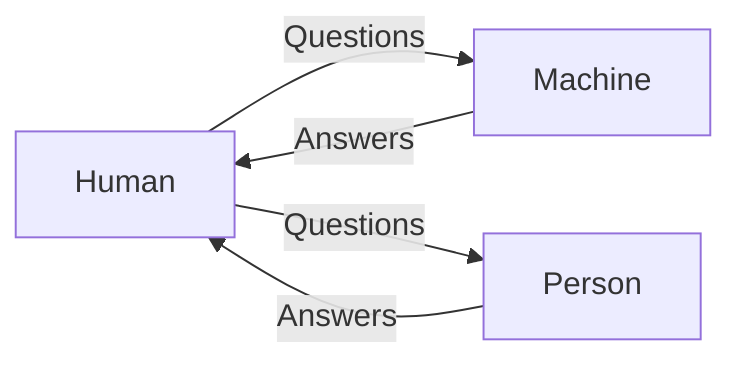
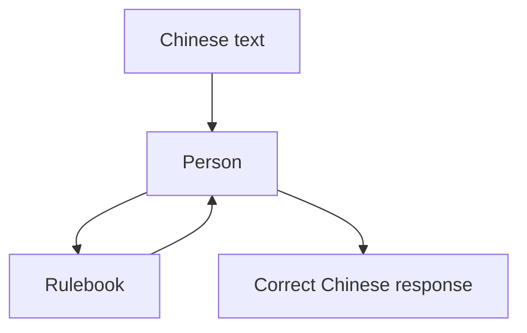
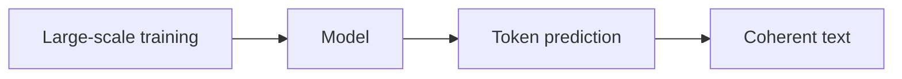

## Introduction

With the recent advances in artificial intelligence — especially generative models like GPT — classic philosophical debates have become relevant again.

One of the most engaging ways to explore these ideas is through games like **The Turing Test**, which blends puzzles with deep questions about consciousness, language, and intelligence.

## The Turing Test

Proposed by Alan Turing in 1950, the test tries to answer a simple question:

> Can machines think?

The idea is practical: if a human interacts with a machine and cannot distinguish it from another human, then the machine can be considered intelligent.

The focus is not **how** the machine works internally, but **how it behaves externally**.

## The Chinese Room

John Searle proposed a famous counterargument: the **Chinese Room**.

Imagine you are inside a closed room. You don’t understand Chinese, but you have a rulebook that tells you exactly how to respond to Chinese symbols.

To someone outside, it appears that you understand Chinese — but in reality, you're just manipulating symbols.

Searle’s conclusion:

> Following rules is not the same as understanding.

## Where does modern AI fit?

This is where things get interesting.

Models like GPT (and other LLMs) essentially behave like extremely advanced versions of the "Chinese Room":

- They have no consciousness
- They don’t "understand" in the human sense
- They operate through statistical patterns and probabilities

At the same time:

- They can sustain complex conversations
- Generate code, text, and reasoning
- Frequently pass variations of the Turing Test

This raises a practical question:

> If something behaves intelligently, does the difference between "simulating" and "being" intelligent really matter?

## The role of The Turing Test (game)

The game **The Turing Test** uses puzzles to explore exactly this dilemma.

As the story unfolds, you begin to question:

- Who is really making decisions?
- Is there intention or just rule execution?
- How much can we trust observable behavior?

## Video

Here is the original video version of this content:

<iframe 
  width="100%" 
  height="400" 
  src="https://www.youtube.com/embed/uoryUuqInbM" 
  frameborder="0" 
  allowfullscreen>
</iframe>

## Conclusion

The debate between the Turing Test and the Chinese Room is more relevant than ever.

With modern AI, we are no longer just asking *"can machines think?"*, but also:

- What does it mean to "think"?
- Does intelligence require consciousness?
- Or is behavior enough?

Perhaps the answer lies not in choosing a side, but in accepting that we are redefining intelligence in real time.
