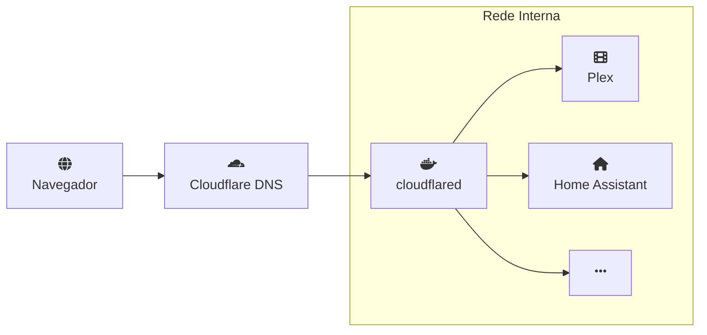

Um Homelab é a forma mais prática de aprender infraestrutura, serviços e automação sem depender de data centers caros.

Neste post eu explico como um **notebook antigo** pode ser uma ótima base para um home lab caseiro, como o **Linux** e o **Docker** ajuda a manter tudo organizado, qual é o papel do **reverse proxy** e como usar **domínio próprio + Cloudflare** para acessar seus serviços de forma segura de qualquer lugar do mundo.

## O que é Homelab?

Homelab é um ambiente de teste e aprendizado montado em casa, geralmente com hardware próprio, para rodar serviços de rede, servidores e automação.

Não é um data center, mas sim uma infraestrutura caseira onde você pode experimentar Linux, containers, proxies, domínios e integrações sem depender de provedores externos.

Além de tudo isso, você ainda pode instalar aplicativos e serviços uteís.

## Por que usar um notebook velho?

O maior valor do homelab não é potência, é oportunidade.

- um notebook abandonado já tem CPU, memória, disco e fonte de energia
- dá para testar sem gastar nada além de tempo
- é fácil de mover e conectar em diferentes redes
- o consumo costuma ser menor do que um desktop de mesa
- você pode usar bateria como pequeno no-break em quedas curtas

Com hardware reaproveitado, a melhor prática é aceitar que esse ambiente será experimental. Não vá colocar serviços críticos, mas sim um conjunto de ferramentas para aprender e automatizar.

## Linux + Docker: a dupla certa para começar

Para um homelab leve e previsível, minha recomendação é instalar uma distribuição Linux estável e rodar serviços em containers. No meu caso, utilizo o *Mint*, simplemente porque ele já estava instalado no notebook antes.

### Por que Linux?
Geralmente distrubuições linux podem dar vida nova a hardwares mais antigos, isso adicionado ao fato de que existem inúmeras distros diferentes para escolher, tornam a experiência bem customizável

### O que é docker?
Docker é uma plataforma que empacota aplicativos e suas dependências em containers leves,imagine máquinas virtuais, mas menores e mais leves para rodar. Cada container tem apenas o que o serviço precisa para rodar, o que evita conflitos entre aplicações e mantém o sistema base limpo.

### Por que Docker?
- isola cada aplicativo em seu próprio ambiente
- oferece upgrades e rollback mais seguros
- facilita criar e recriar o lab rapidamente
- remove a necessidade de instalar dependências diretamente no sistema

Existe uma ferramente chamada `docker-compose` que possibilita criar vários containers em um único arquivo de configuração. Em vez de iniciar cada serviço manualmente, você descreve imagens, volumes, portas e redes em um só lugar e sobe tudo com um único comando, `docker compose up -d`.

Um exemplo simples de `docker-compose.yml`:

```yaml
services:
  plex:
    image: linuxserver/plex
    volumes:
      - ./plex/config:/config
      - ./plex/media:/data
    ports:
      - '32400:32400'
    restart: unless-stopped

  homeassistant:
    image: ghcr.io/home-assistant/home-assistant:stable
    volumes:
      - ./homeassistant/config:/config
    network_mode: host
    restart: unless-stopped
```

No exemplo acima, temos dois serviços configurados

## Como acessar os serviços do homelab
A maior parte dos serviços que você roda no homelab são aplicativos web. Isso significa que eles geralmente têm uma interface acessível pelo navegador.

No começo, é comum acessar cada serviço diretamente pelo IP do notebook e a porta usada pelo container. Por exemplo:

- `http://192.168.0.50:32400` para Plex
- `http://192.168.0.50:8123` para Home Assistant
- `http://192.168.0.50:8080` para qBittorrent

Para evitar que o IP mude, vale configurar o modem/roteador para *reservar um endereço estático* ao homelab ou usar DHCP estático. Assim, o mesmo IP local permanece disponível sempre que o dispositivo voltar à rede.

## Acessando via internet
Muito bem, agora os serviços podem ser acessados dentro da sua casa com IP, mas e se você quiser acessar suas séries favoritas quando estiver fora de casa?

Aí entra o conceito de proxy reverso. Ele permite transformar vários serviços locais em URLs amigáveis e acessíveis pela internet, como `plex.seudominio.com`, redirecionando cada pedido para o serviço correto sem expor portas diferentes diretamente.

## Entendendo o proxy reverso

O proxy reverso é a porta de entrada do seu homelab. Ele recebe as requisições externas e encaminha para o serviço correto.

Imagine ter:

- `plex.seudominio.com`
- `home.seudominio.com`
- `qbittorrent.seudominio.com`

Tudo isso cai no mesmo IP/porta exterior e o reverse proxy distribui para o container certo.

### Vantagens do reverse proxy

- permite usar apenas uma porta pública (geralmente 80/443)
- gera certificados TLS centralizados
- protege serviços internos que não precisam ficar expostos diretamente
- facilita o roteamento por hostname ou caminho
- adiciona cache e regras de segurança quando necessário

### Ferramentas comuns

- **Nginx**: flexível e leve
- **Caddy**: TLS automático e configuração simples
- **Traefik**: bom para ambientes com muitos containers
- **cloudflared**: pode rodar como container Docker para evitar instalar binários no host

## Domínio próprio + Cloudflare DNS com Tunnel

Usar domínio próprio deixa o homelab mais profissional e facilita lembrar os endereços.

### Passos básicos

1. registre um domínio
2. aponte o DNS para o Cloudflare
3. crie registros do tipo `CNAME` ou `A` para os subdomínios
4. configure um **Cloudflare Tunnel** com `cloudflared`

O `cloudflared` é uma opção excelente para homelab quando sua rede não tem IP público fixo ou quando você prefere não abrir portas no roteador. No contexto do homelab, faz muito sentido rodar o `cloudflared` como um container Docker ao lado dos outros serviços.

Com o tunnel, o caminho fica assim:



Isso traz:

- conexão segura sobre HTTPS
- ocultação do IP real
- menor necessidade de mexer nas regras do roteador

### Exemplo de configuração rápida

```bash
# login no Cloudflare (pode ser feito no host uma vez)
cloudflared login

# criar tunnel
cloudflared tunnel create meu-homelab

# criar rota DNS
cloudflared tunnel route dns meu-homelab homelab.seudominio.com
```

### Exemplo de `docker-compose.yml` para `cloudflared`

```yaml
services:
  cloudflared:
    image: cloudflare/cloudflared:latest
    container_name: cloudflared
    restart: unless-stopped
    network_mode: bridge
    volumes:
      - ./cloudflared:/etc/cloudflared
    command: tunnel run meu-homelab
```

Depois, no `cloudflared.yml`, você pode mapear múltiplos serviços:

```yaml
tunnel: <TUNNEL_ID>
credentials-file: /home/user/.cloudflared/<TUNNEL_ID>.json

ingress:
  - hostname: plex.seudominio.com
    service: http://localhost:32400

  - hostname: home.seudominio.com
    service: http://localhost:8123

  - hostname: qbittorrent.seudominio.com
    service: http://localhost:8080

  - service: http_status:404
```

## Apps interessantes para rodar no Homelab

Algumas aplicações que fazem muito sentido em um ambiente caseiro:

- [Plex](https://www.plex.tv/) ou [Jellyfin](https://jellyfin.org/): mídia local e acesso remoto para vídeos e músicas
- [Home Assistant](https://www.home-assistant.io/): automação residencial e integração com dispositivos
- [qBittorrent](https://www.qbittorrent.org/): downloads gerenciados em um container isolado
- [Portainer](https://www.portainer.io/): interface para ver e administrar containers Docker
- [Vaultwarden](https://github.com/dani-garcia/vaultwarden): cofre de senhas leve e auto-hospedado
- [Uptime Kuma](https://github.com/louislam/uptime-kuma): monitoramento simples de serviços
- [Nextcloud](https://nextcloud.com/): nuvem pessoal para arquivos e notas

Essas ferramentas são ótimas para aprender, porque envolvem rede, armazenamento e autenticação.

## Algumas boas práticas para um homelab saudável

- mantenha backups dos dados mais importantes
- atualize containers com frequência
- monitore o calor e consumo do notebook
- use volume externo ou SSD se possível
- evite misturar serviços de produção com experimentos perigosos

---

## Conclusão

O objetivo do homelab não é necessariamente ser perfeito, mas sim ser um terreno de testes onde você pode aprender sem medo.

Um notebook antigo é um excelente ponto de partida: ele permite experimentar Linux, Docker, proxy reverso e domínios próprios com custo quase zero.

Brincar com homelab é uma forma de transformar curiosidade em infraestrutura real e de aproveitar hardware esquecido para algo útil e divertido.
