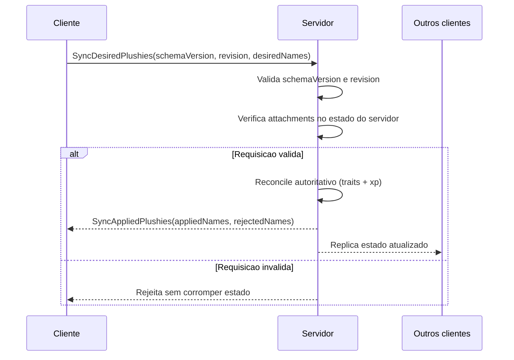

## O ponto de partida

Quando comecei o mod das Naninhas, tudo parecia estável no *singleplayer*. O *loop* principal funcionava, os *buffs* eram aplicados, os eventos disparavam e a experiência estava redonda. O problema apareceu quando essa mesma lógica foi para o *multiplayer*: de repente, aquilo que era previsível localmente passou a depender de latência, ordem de eventos e sincronização entre processos diferentes.

Em outras palavras, o que quebrava não era só código. Era o modelo mental.

## A virada: servidor como autoridade

No Naninhas, a aplicação de *traits* e bônus de XP precisa ser autoritativa no servidor. O cliente detecta mudanças de *attachment* e publica o estado desejado, mas quem decide o estado final é o servidor. Essa separação foi o que realmente reduziu *desync*.

O fluxo que estabilizou o mod ficou assim: o cliente envia o conjunto desejado de *plushies*, o servidor valida o *payload*, confirma o que está de fato anexado no inventário e então reconcilia efeitos. Só depois disso ele responde com o conjunto aplicado.

## O contrato de rede que fez diferença

No plano de *multiplayer*, duas escolhas foram fundamentais: usar *schemaVersion* no protocolo e um *revision* monotônico por cliente. Parece detalhe, mas não é. Em ambiente real de jogo, mensagem atrasada chega, mensagem fora de ordem chega, reconexão acontece. Sem versionamento e sem controle de revisão, o servidor pode aplicar estado velho por engano.

As validações que mais ajudaram foram poucas e objetivas:

- rejeitar *schemaVersion* incompatível;
- rejeitar *revision* antigo;
- rejeitar *plushie* desconhecida;
- confirmar *server-side* se o item está realmente anexado.

Com isso, o sistema ficou muito mais resiliente contra *payload* inválido e contra inconsistência de sessão.

## *Reconcile* completo em vez de remendo incremental

Outro aprendizado importante foi adotar *recompute* completo do *snapshot* autoritativo. Em vez de tentar ajustar estado aos poucos e correr o risco de *stacking* duplicado, o servidor recompõe o estado alvo a partir do conjunto ativo atual, remove o que ficou obsoleto e só então reaplica o que deve permanecer.

Na prática, essa abordagem ficou mais fácil de testar, mais segura para casos de *overlap* entre *plushies* e melhor para idempotência. Repetir a mesma *sync* não deveria acumular efeito, e com *reconcile* por *snapshot* isso ficou muito mais previsível.

## Eventos, *timing* e o que ainda dói

Mesmo com a arquitetura certa, *timing* continua sendo parte crítica da experiência. Os eventos de atualização do mod, como NaninhasEquipped, NaninhasUnequipped e NaninhasUpdate, podem acontecer em momentos em que o cliente ainda não recebeu o estado final. Se a *UI* reage cedo demais, aparecem *flicker* e correções bruscas.

O ajuste aqui foi simples de explicar e trabalhoso de acertar: processar interação e feedback visual apenas quando o estado mínimo necessário estiver coerente. Esse cuidado evitou boa parte dos sintomas visuais de desync sem sacrificar responsividade.

## Sobre *SP* vs *MP* hoje

Nos documentos de otimização futura, a ideia de unificar totalmente *SP* e *MP* em um único caminho autoritativo já está mapeada, mas com cautela. Hoje o *split* existe por estabilidade: *singleplayer* mantém o caminho direto legado e *multiplayer* roda no fluxo autoritativo com *sync* de rede. A proposta de unificação vem depois de mais ciclos estáveis no *MP*.

Esse ponto é importante porque mostra uma decisão de engenharia que nem sempre aparece no código isolado: às vezes o melhor desenho final não é o próximo passo imediato.

## Fechamento

Adicionar *multiplayer* ao Naninhas não foi só "adaptar para rede". Foi transformar a *feature* em um sistema distribuído com contrato explícito, validação defensiva e reconciliação determinística.

Se eu tivesse que resumir em uma frase, seria a mesma que guiou toda a migração:

***singleplayer* mascara inconsistências; *multiplayer* obriga arquitetura.**

