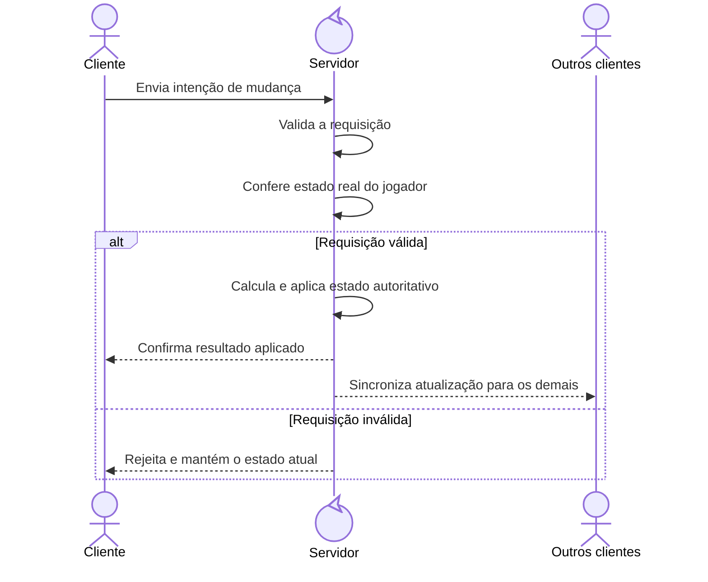

## O ponto de partida

Quando comecei o mod das [Naninhas](https://steamcommunity.com/sharedfiles/filedetails/?id=3624617298), tudo estava estável no *singleplayer*. O *loop* principal funcionava, os *buffs* eram aplicados, os eventos disparavam e a experiência estava redonda. O problema apareceu quando essa mesma lógica foi para o *multiplayer*: de repente, aquilo que funcionava perfeitamente, simplesmente não fazia nada.

Aí caiu a ficha: "Quer dizer então que jogos *Multiplayer* precisam funcionar para todos os *players*, quem poderia imaginar!".


Ficou claro que eu precisaria repensar como o mod das *Naninhas* funcionava e adaptá-lo para o *Multiplayer*. Afinal, o motivo de ter criado o *Mod* era exatamente jogar com meus amigos no nosso servidor de **Zomboid**.

## A virada de chave: servidor como autoridade

No **Naninhas**, a aplicação de *traits* e bônus de XP precisa ser **autoritativa** no servidor. O cliente detecta mudanças de *attachment* e publica o estado desejado, mas quem decide o estado final é o servidor.

Para ficar menos abstrato, vamos ao fluxo do *mod*:
 
1. o **Cliente** envia o conjunto desejado de *plushies*
2. o **Servidor** valida o *payload*, confirma o que está de fato anexado no inventário
3. o **Servidor** reconcilia efeitos
4. o **Servidor** responde com o conjunto aplicado.



Em resumo: o cliente pede, mas quem decide e aplica é sempre o servidor.

## O contrato de rede que fez diferença

Ao planejar como o *multiplayer* funcionaria, o maior problema é como evitar que o servidor aplique estados por engano, caso contrário, os *buffs* poderiam ser aplicados em duplicidade, ou continuar aplicados mesmo sem a naninha estar na mochila. 

Para solucionar este problema, duas escolhas foram fundamentais: usar um *schemaVersion* no protocolo e um número de *revision* monotônico por cliente. Em ambiente real de jogo, mensagem atrasada chega, mensagem fora de ordem chega, reconexão acontece. Sem esse versionamento (*schemaVersion*) e sem controle de revisão (*revision*), o servidor pode aplicar um estado velho por engano.


As validações que mais ajudaram foram poucas e objetivas:

- rejeitar *schemaVersion* incompatível;
- rejeitar *revision* antigo;
- rejeitar *plushie* desconhecida;
- confirmar *server-side* se o item está realmente anexado.

Com isso, o sistema ficou muito mais resiliente contra *payload* inválido e contra inconsistência de sessão.

### Exemplo real: cliente publicando estado desejado

Agora vamos trazer isso para o código. Este é o coração do lado cliente: quando detecta mudança nos itens anexados, ele incrementa a *revision* e envia o estado desejado para o servidor.

```typescript
private send(names: Set<string>): void {
  // Incrementa a revisão para cada envio; isso permite ao servidor
  // detectar e descartar mensagens antigas ou fora de ordem.
  this.revision++;
  // Guarda um snapshot local do último conjunto enviado.
  // Assim o cliente sabe se houve mudança no próximo tick e evita reenvio inútil.
  this.lastKnownNames = new Set(names);

  const payload: SyncDesiredPlushiesPayload = {
    schemaVersion: PROTOCOL_SCHEMA_VERSION,
    revision: this.revision,
    desiredNames: [...names]
  };

  sendClientCommand(
    this.playerApi.player,
    NETWORK_MODULE,
    NetworkCommands.SyncDesiredPlushies,
    payload
  );
}
```

Repare que o cliente não aplica *trait* nem bônus de XP por conta própria nesse fluxo. Ele só publica intenção para o servidor.

### Exemplo real: servidor validando e rejeitando estado antigo

No lado do servidor, a defesa principal é bloquear mensagem fora de ordem para evitar sobrescrever estado novo com estado velho.

```ts
if (payload.revision <= protocol.lastClientRevision) {
  // Se chegou uma revisão menor/igual à última aceita,
  // a mensagem está atrasada e deve ser ignorada.
  this.sendRejectReply(player, payload);
  return;
}
```

Esse pequeno bloco foi um dos que mais ajudaram a reduzir problemas de reconexão e latência.

Na prática, esse tipo de validação simples evita uma boa parte dos bugs "fantasmas" de sincronização.

## *Reconcile* completo em vez de remendo incremental

Outro aprendizado importante foi adotar *recompute* completo do *snapshot* autoritativo. Em vez de tentar ajustar estado aos poucos e correr o risco de *stacking* duplicado, o servidor recompõe o estado alvo a partir do conjunto ativo atual, remove o que ficou obsoleto e só então reaplica o que deve permanecer.

Se isso parece grego, calma que eu explico: em vez de ficar "remendando" o que mudou, o servidor olha para o estado atual e recalcula tudo do zero, como tirar uma foto nova da situação naquele momento. Isso evita herdar erro antigo, evita bônus duplicado e deixa o resultado final mais previsível.

Em termos simples: menos remendo incremental, e estado final consistente.


Na prática, essa abordagem ficou mais fácil de testar, mais segura para casos de *overlap* entre *plushies* e melhor para idempotência. Repetir a mesma *sync* não deveria acumular efeito, e com *reconcile* por *snapshot* isso ficou muito mais previsível.

### Exemplo real: *reconcile* puro e previsível

Para visualizar melhor, este trecho mostra a parte do *reconciler* que calcula a diferença entre o que está ativo e o que deveria estar ativo.

```typescript
const currentAddedTraits = new Set(currentState.addedTraits);
const desiredAddedTraits = new Set<string>();

// Diferença entre estado atual e estado desejado.
const traitsToAdd = [...desiredAddedTraits].filter(t => !currentAddedTraits.has(t));
const traitsToRemove = [...currentAddedTraits].filter(t => !desiredAddedTraits.has(t));

return {
  traitsToAdd,
  traitsToRemove,
  traitsToSuppress,
  traitsToRestore,
  xpBoostDeltas,
  newState
};
```

Esse formato deixa os testes mais diretos: dado um estado **A** e um estado desejado **B**, você valida se o plano retornado é exatamente o esperado.

Isso também melhora manutenção: quando algo quebra, fica mais fácil localizar se o problema está na entrada, no cálculo ou na aplicação.


## Eventos, *timing* difícil de acertar

Mesmo com a arquitetura certa, *timing* continua sendo parte crítica da experiência. Os eventos de atualização do mod, como `NaninhasEquipped`, `NaninhasUnequipped` e `NaninhasUpdate`, podem acontecer em momentos em que o cliente ainda não recebeu o estado final.


Para não ficar abstrato, estes foram dois ajustes reais no código.

### Exemplo real: ordem fixa no ciclo do cliente

No ciclo de atualização, primeiro o mod atualiza os observadores locais e só depois publica o estado desejado para o servidor.

```typescript
// 1) Atualiza eventos locais (UI/*hooks*)
this.subject.update();

// 2) Publica estado desejado para sincronização autoritativa
this.syncPublisher.tick();
```

Essa ordem evita misturar responsabilidades no mesmo passo: o cliente cuida de eventos locais e o servidor cuida do estado final.

### Exemplo real: eventos no cliente, efeitos no servidor

Outro ponto foi manter os eventos no cliente apenas como sinalização, sem aplicar *traits* ou XP localmente.

```typescript
public subscribe() {
  triggerEvent(EventsEnum.Equipped, {
    name: this.name,
    ...this.data
  } as EventData);
}
```

Perceba que aqui só existe `triggerEvent`. A aplicação autoritativa de *traits* e bônus acontece no servidor, no fluxo de *reconcile*.

### Exemplo real: tratando reconexão como caso especial

Um caso de *timing* que causou bastante problema foi a reconexão. Quando um cliente reconecta, o `PlushieSyncPublisher` é recriado do zero e a *revision* volta para 1. Sem um tratamento explícito, o servidor rejeitaria essa primeira mensagem pós-reconexão por enxergá-la como *revision* antiga.

```typescript
// Reconexão recria o publisher e reinicia a revision para 1.
// Aceitar esse reset evita que o servidor rejeite permanentemente
// o primeiro envio após qualquer reconexão.
if (payload.revision === 1 && protocol.lastClientRevision > 0) {
  protocol.lastClientRevision = 0;
}
```

Esse detalhe é pequeno no código mas resolve um problema real: sem ele, qualquer reconexão resultaria em estado nunca sincronizado até o servidor ser reiniciado.

Com esses três pontos juntos: ordem no ciclo, responsabilidade separada de evento/efeito e tratamento de reconexão; O *timing* deixou de ser um problema imprevisível e passou a ser algo tratado explicitamente.

## Unificando *Singleplayer* e *Multiplayer*

Para evitar trabalho duplicado, tive a ideia de unificar totalmente a lógica *Singleplayer* e *Multiplayer* em um único caminho autoritativo, ou seja, aproveitar uma característica do **Zomboid**, que é o fato do *Singleplayer* também ser, tecnicamente, um servidor e aplicar o mesmo código, sem duplicação entre os modos de jogo.

Esse foi o próximo passo natural para reduzir complexidade sem perder confiabilidade.

---

## Conclusão

Adicionar *multiplayer* ao Naninhas não foi só "adaptar para rede". Foi transformar todo o *mod* em um sistema distribuído com contrato explícito, validação defensiva e reconciliação determinística.


---

## Veja no GitHub
Aqui está o [link do *pull request*](https://github.com/Dihgg/naninhas/pull/30) responsável pela atualização do **Naninhas** para suporte a **Multiplayer**. Dê uma olhada.
