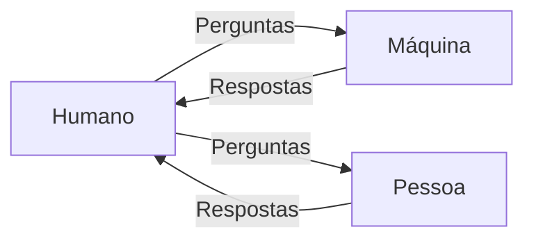
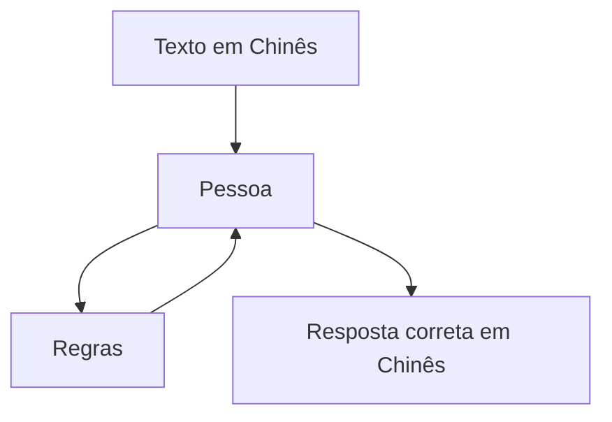
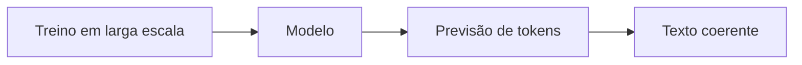

Com o avanço recente da inteligência artificial — especialmente com modelos generativos como GPT — antigas discussões filosóficas voltaram ao centro das atenções.

Uma das formas mais interessantes de explorar essas ideias é através de jogos como **The Turing Test**, que mistura puzzles com questionamentos profundos sobre consciência, linguagem e inteligência.

## O Teste de Turing

Proposto por Alan Turing em 1950, o teste busca responder uma pergunta simples:

> Máquinas podem pensar?

A ideia é prática: se um humano conversa com uma máquina e não consegue distinguir se está falando com outro humano, então essa máquina pode ser considerada inteligente.

O foco aqui não é **como** a máquina funciona internamente, mas sim **como ela se comporta externamente**.

## A Sala Chinesa

John Searle propôs um contra-argumento famoso: o experimento da **Sala Chinesa**.

Imagine que você está em uma sala fechada. Você não entende chinês, mas possui um manual com regras que dizem exatamente como responder a símbolos chineses.

Para alguém fora da sala, parece que você entende chinês — mas, na prática, você está apenas manipulando símbolos.

A conclusão de Searle:

> Seguir regras não é o mesmo que compreender.

## Onde entram as IAs modernas?

Aqui é onde a discussão fica interessante.

Modelos como GPT (e outros LLMs) funcionam, essencialmente, como versões extremamente avançadas da "Sala Chinesa":

- Não possuem consciência
- Não "entendem" no sentido humano
- Operam através de padrões estatísticos e probabilidade

Mas ao mesmo tempo:

- Conseguem manter conversas complexas
- Produzem código, textos e raciocínios
- Enganam facilmente o Teste de Turing em muitos contextos

Isso levanta uma questão prática:

> Se algo se comporta como inteligente, a diferença entre "simular" e "ser" inteligente realmente importa?

## O papel de The Turing Test (o jogo)

O jogo **The Turing Test** usa puzzles para explorar exatamente esse dilema.

Ao longo da narrativa, você começa a questionar:

- Quem está realmente tomando decisões?
- Existe intenção ou apenas execução de regras?
- Até que ponto confiar no comportamento externo?

## Vídeo

Para complementar, aqui está o vídeo original do conteúdo:

<iframe 
  width="100%" 
  height="400" 
  src="https://www.youtube.com/embed/uoryUuqInbM" 
  frameborder="0" 
  allowfullscreen>
</iframe>

## Conclusão

A discussão entre o Teste de Turing e a Sala Chinesa continua extremamente atual.

Com o avanço das IAs modernas, deixamos de perguntar apenas *"máquinas podem pensar?"* e passamos a questionar:

- O que é, de fato, "pensar"?
- Inteligência precisa de consciência?
- Ou comportamento já é suficiente?

Talvez a resposta não esteja em escolher um lado, mas em aceitar que estamos redefinindo o conceito de inteligência em tempo real.
